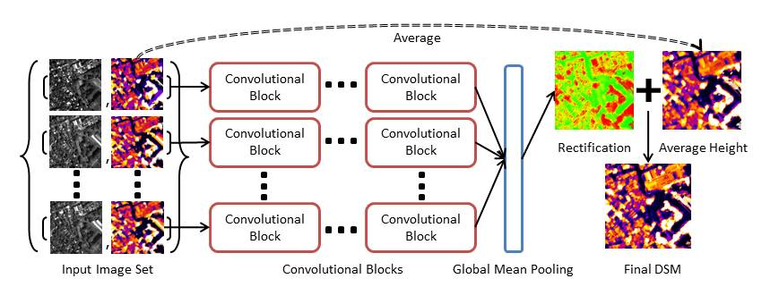
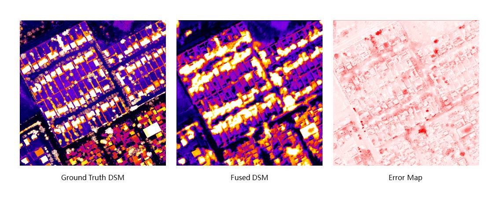

# Rectify the Static Assumption of Multi-View Stereo 3D Mapping with DeepVote Model

The DeepVote model aims at rectifying the inaccuracy caused by the violation of the static assumption of Binocular(Pairwise) Stereo Matching (BSM) algorithms, which are widely used in the process of Multi-View Stereo 3D mapping for satellite imagery.

## Pre-requisites
* Python 2.7
* PyTorch
* Numpy
* Scipy

## Network Architecture

The network takes as input a set of the arbitrary number of images with two channels: color, and height which is calculated by BSM. 
The base model contains a series of convolutional blocks applied elementwise to extract local features. A global mean pooling 
operation is employed in the end to calculate the final rectification. The final DSM is obtained as the aggregation of the retification and 
the average of the input height maps. Each convolutional block includes several convolutional permutation equivalence layers with leakyReLU 
activation function and BatchNorm layers. The whole architecture is shown as below.



## Preparation 

First, create the enviroment with Anaconda. Installing Pytorch with the other versions of CUDA can be found at [Pytorch document](https://pytorch.org/get-started/previous-versions/). Here Pytorch 3.1.0 and CUDA 9.0 are used:
```
  mkdir DeepVote DeepVote/data DeepVote/results
  cd DeepVote
  git clone git@github.com:SongweiGe/DeepVote.git
  conda create -n DeepVote python=2.7
  conda activate DeepVote
  conda install scipy, pytorch=0.3.1 cuda90 -c pytorch
```

Then download the `data/` folder from the link https://drive.google.com/open?id=1_2XN9GNBW7458o_4nrzaQ838UEoxUU7V to directory `cd data/`. The data are processed from [IARPA Multi-View Stereo 3D Mapping Challenge](https://www.iarpa.gov/challenges/3dchallenge.html). The input height and color images are stored in `data/MVS` and the ground truth DSM are stored in `data/DSM`. The KML files used to crop the areas are stored in `data/kml`.

## Usage

### Training
Change the `exp_name` to whatever you want to call. Also see train_DeepVote.py to adjust hyper-parameters (for eg. change `n_folds` to set the folds number in cross validation experiments). See model_util.py for other variants of Deep Vote model to replace `model` option.
```
python train_DeepVote.py --model base --exp_name base_dv --gpu_id 0 > logs/base_dv_cross_validation.txt
```

### Inference
After training the model, you can use it to fuse any BSM results using the following command. For example, you can download our trained model to `../results/base_dv/base_all` and use it to rectify the arbitrary number of images in folder indicated by `input`. The results will be saved under `reconstruction` folder of the corresponding `exp_name` folder.
```
python infer.py --model base --exp_name base_dv --gpu_id 0 --n_pair 5 --input ../data/MVS/dem_6_18 
```

### Evaluation
We provide the codes to visualize the generated DSM. Command below plot the fused DSM, ground truth DSM and an error map.

```
python plot_height.py --input ../results/base_dv/reconstruction/dem_6_18_base_base_dv.npy --ground_truth ../data/DSM/dem_6_18.npy
```



For a full comparison between the deep vote results and baselines, run the command below. It calculates the metrics including Rooted Mean Square Error, Median Error, L1 Error and Completeness. Four baselines are implemented: Median Fusion, k-Median Fusion, Mean Fusion and Consensus Voting.
```
python run_evals.py --exp_name base --mode test --save_image False > logs/evaluation_base.txt
```
